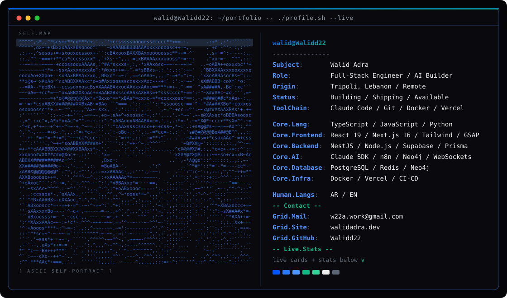
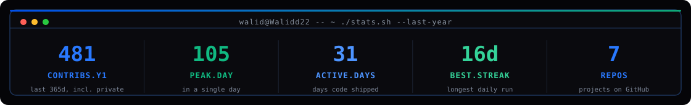
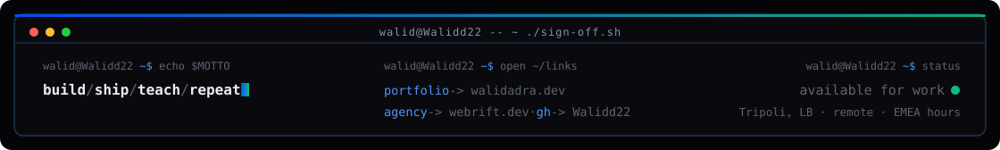

<!-- ============================================================= -->
<!--  Walid Adra — GitHub Profile README                            -->
<!--  Brand: walidadra.dev + webrift.dev — electric blue on black   -->
<!--  Terminal / HUD identity · monospace · zero purple             -->
<!-- ============================================================= -->

<div align="center">

<a href="https://walidadra.dev">
  <picture>
    <source media="(prefers-color-scheme: light)" srcset="./assets/header-light.svg" />
    
  </picture>
</a>

<br/>

<a href="https://git.io/typing-svg"></a>

<br/>

<a href="https://walidadra.dev"></a>
<a href="https://webrift.dev"></a>
<a href="https://www.linkedin.com/in/walid-adra-452363273/"></a>
<a href="https://www.instagram.com/web_rift"></a>
<a href="mailto:w22a.work@gmail.com"></a>

</div>


## `$ whoami`

Self-taught full-stack developer from **Tripoli, Lebanon**. No bootcamp, no visible path in — I opened a laptop, typed `<h1>` into a file to see what happened, and kept going for 1,000+ hours: `HTML → CSS → JavaScript → React`, building, breaking, and reading the errors until they made sense.

Since then I've shipped real systems under deadline — SaaS platforms, real-time trading interfaces, and end-to-end products. I run **[WebRift](https://webrift.dev)**, a small agency building production apps for founders, and I build local-first AI systems on the side. I own the whole path: **architecture → delivery → production fixes**, no hand-holding.


## `$ cat stack.txt`

<div align="center">


</div>


## `$ ls ~/projects`

<details open>
<summary><b>🤖 AI Content Studio</b> — local-first, on-prem AI content pipeline</summary>

<br/>

The content studio I built for my own pipeline — now licensable as a private, on-prem install for clients who want AI content production without a SaaS subscription. Runs on their machine; their data never leaves.

| | |
| :-- | :-- |
| **Stack** | Next.js 16 · React 19 · Neo4j · n8n · Three.js · Claude SDK |
| **Scale** | 33 dashboards · 79 API routes · a Neo4j knowledge graph that grows with every video, topic & insight |
| **Role** | Solo — design to deploy |
| **Status** | 🔵 Active · private / on-prem — walkthrough on request |

</details>

<details>
<summary><b>🍕 MyPizza</b> — full-stack ordering platform</summary>

<br/>

A production restaurant ordering platform built from scratch: auth, real-time orders, admin dashboard, WhatsApp + cash-on-delivery checkout, push notifications, gamification, dual currency, PWA, Redis caching — 10+ integrated systems, end to end.

| | |
| :-- | :-- |
| **Stack** | Next.js 16 · React 19 · Supabase · Redis |
| **Role** | Full-Stack Engineer — end-to-end delivery |
| **Status** | 🟢 Live → [myypizza.com](https://myypizza.com) |
| **Source** | Private — client project |

</details>

<details>
<summary><b>📈 ArisAI</b> — AI-powered trading platform</summary>

<br/>

Joined an AI trading platform mid-build and led frontend delivery under tight deadlines — ~80% of the frontend across a monorepo (React web, Next.js landing, Expo mobile, Remotion video). 15+ data-dense, real-time pages: trading dashboards, signal rooms, streaming AI chat, and the content engine.

| | |
| :-- | :-- |
| **Stack** | React · TypeScript · WebSockets · Tailwind · (NestJS backend) |
| **Role** | Lead Frontend Engineer · ~3 months · 15+ pages |
| **Status** | 🟢 Live → [aristrading.ai](https://aristrading.ai) |
| **Case study** | [walidadra.dev → ArisAI](https://walidadra.dev/projects/aris-ai.html) |

</details>

<details>
<summary><b>👗 Sadou Studio</b> — AI fashion-photoshoot SaaS <i>(front-end prototype)</i></summary>

<br/>

A design-complete front end for an AI fashion-photoshoot product — on-model photos and video from a source garment. Full studio wizard, credit system, and marketing site. A UI/architecture prototype: the generation flow runs end-to-end over a **mocked engine**, ready to wire into a real provider.

| | |
| :-- | :-- |
| **Stack** | Next.js 16 · React 19 · Tailwind v4 · Radix UI · Server Actions |
| **Role** | Solo — design & frontend |
| **Status** | 🔵 Prototype — front end complete, generation mocked |

</details>

<details>
<summary><b>🛰️ WebRift</b> — agency brand & website</summary>

<br/>

The home of my agency — an animated, hand-built static site with project showcases and case studies.

| | |
| :-- | :-- |
| **Stack** | HTML5 · CSS3 · JavaScript · GSAP · Lenis |
| **Role** | Solo — design & development |
| **Status** | 🟢 Live → [webrift.dev](https://webrift.dev) · [source](https://github.com/Walidd22/webrift-website) |

</details>


## `$ git log --author="Walid Adra"`

```log
* now        Founder & Full-Stack Engineer · WebRift
|              build & ship production apps for founders, end to end
|
* ~3 months  Lead Frontend Engineer · ArisAI (AI trading platform)
|              owned ~80% of the frontend — 15+ real-time pages, React + WebSockets
|
* solo build Full-Stack Engineer · MyPizza (myypizza.com)
|              full ordering platform from scratch — Next.js + Supabase + Redis
|
* internship Software Engineering Intern · Telecloud Vision, Beirut
                first production code — code review, git flow, real users
```


## `$ cat focus.yaml`

```yaml
building:   WebRift client products · a local-first AI Content Studio
working_on: real-time systems · full-stack SaaS · production delivery
learning:   AI content pipelines · knowledge graphs · automation
open_to:    contract & freelance · remote · EMEA hours
```


## `$ ./stats.sh --last-year`

<picture>
  <source media="(prefers-color-scheme: light)" srcset="./assets/stats-light.svg" />
  
</picture>


<a href="https://walidadra.dev">
  <picture>
    <source media="(prefers-color-scheme: light)" srcset="./assets/footer-light.svg" />
    
  </picture>
</a>
