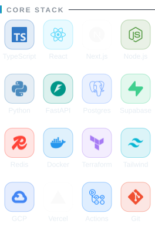

<!--
  Walid Adra — GitHub profile README.
  Cards under assets/ are rebuilt daily by .github/workflows/stats.yml (scripts/build-stats.mjs);
  the contribution snake by .github/workflows/snake.yml.
-->

<a href="https://walidadra.dev"><picture><source media="(prefers-color-scheme: light)" srcset="./assets/header-light.svg" /></picture></a>

## 👋 About Me

I'm a full-stack and platform engineer in **Tripoli, Lebanon**, working remotely across EMEA hours.

I build systems where mistakes are expensive: money moving, personal data, decisions about people. I own them end to end, from the schema to the deploy, including the access model and the infrastructure underneath. I run **[WebRift](https://webrift.dev)**, a studio that ships production platforms for founders.

Most of this year went into two AI platforms under NDA, so they appear below without client, product name or market. The engineering behind them is written up in full at **[walidadra.dev/engineering](https://walidadra.dev/engineering.html)**.

- 🔭 &nbsp;**Building** — AI platforms under NDA · WebRift client work
- 🎯 &nbsp;**Focus** — multi-tenant &amp; regulated systems · AI integration · platform delivery
- 🌍 &nbsp;**Languages** — English · Arabic (real RTL in production)
- ⚡ &nbsp;**Open to** — contract &amp; freelance · remote · EMEA hours

## 🧩 What I Build

<table>
<tr>
<td width="50%" valign="top">

#### 🏢 Multi-tenant &amp; regulated
Row-level security on every tenant table, append-only audit, capability grants, and residency gates that survive a change of cloud.

</td>
<td width="50%" valign="top">

#### 🤖 AI-integrated products
Agent graphs, retrieval across vector and graph stores, real-time voice, and human approval on anything the model can't be trusted to get right.

</td>
</tr>
<tr>
<td width="50%" valign="top">

#### ☁️ Platform &amp; infrastructure
Containers, infrastructure as code, and CI that gates typecheck, lint, tests, secret scanning and static analysis.

</td>
<td width="50%" valign="top">

#### 🖥️ Interfaces that hold up
Data-dense operator consoles, bilingual EN/AR with real RTL, installable PWAs, motion and 3D.

</td>
</tr>
</table>

## 🛠️ Tech Stack

  <picture>
    <source media="(prefers-color-scheme: light)" srcset="./assets/core-light.svg" />
    
  </picture>
  &nbsp;&nbsp;&nbsp;
  <picture>
    <source media="(prefers-color-scheme: light)" srcset="./assets/stack-light.svg" />
    
  </picture>

## 🚀 Featured Work

<table>
<tr>
<td width="50%" valign="top">

#### 🧠 AI Marketing-Intelligence Platform
 

Reads a client's analytics and commerce accounts, proposes campaigns and runs them on connected ad accounts. Nothing reaches a live account without two separate human approvals.

`Python` `FastAPI` `LangGraph` `pgvector` `BigQuery` `dbt` `React 19` `Expo` `Terraform`

1,053 commits · 346 Python modules · 9 CI/CD workflows · 11 ADRs

</td>
<td width="50%" valign="top">

#### 🎙️ Bilingual AI Voice-Interview Engine
 

Runs real voice interviews in Arabic and English and returns evidence-cited assessments. A process killed mid-interview resumes exactly where it stopped.

`Next.js 16` `React 19` `Drizzle` `Postgres` `Python` `Pipecat` `better-auth`

501 commits · 29 screens · 23 migrations · 72 test suites

</td>
</tr>
<tr>
<td width="50%" valign="top">

#### 🐟 [Mahramji](https://almahramji.com)
 

Seafood restaurant on the Mina corniche. Guests scan a QR code for an EN/AR menu priced in dollars or lira; the owner runs the whole site from a dashboard.

`Next.js 16` `Supabase` `TOTP 2FA` `RLS` `Vercel`

172 commits · 67 dishes · 9 migrations · 90 tests

</td>
<td width="50%" valign="top">

#### 🧾 Ordering &amp; Delivery Platform
 

Storefront, staff back-office and everything between: signed per-tab permissions, Redis in front of a hot menu, web push to the counter, WhatsApp checkout.

`Next.js 16` `Supabase` `Redis` `Web Push` `JOSE`

114 commits · 13 screens · 22 API routes

</td>
</tr>
<tr>
<td colspan="2" valign="top">

#### 🛰️ [WebRift](https://webrift.dev) — agency site
 

The home of my studio: a hand-built animated site with no framework and no build step. &nbsp;`JavaScript` `GSAP` `Lenis` `CSS3` · [source](https://github.com/Walidd22/webrift-website)

</td>
</tr>
</table>

## 📐 Engineering Principles

The systems above have little in common except these rules. Each one says what the system is **not allowed** to do, because a rule enforced by good intentions only shows up in an incident report.

1. **No automated system spends a client's money on its own.**
2. **Regulated data does not leave the jurisdiction it was collected in.**
3. **Row-level security nobody has attacked is a comment, not a control.**
4. **History is append-only.** Audit writes go through triggers, not app code.
5. **Access is a grant,** never a URL somebody could guess.
6. **A value that maps to money comes from a closed registry,** never free text.
7. **Long-running state is derived,** never remembered.
8. **What isn't built is visibly absent,** never simulated.

All eight, with the mechanism that enforces each → <a href="https://walidadra.dev/engineering.html">walidadra.dev/engineering</a>

## 📊 GitHub Analytics

Most of my work lives in private client repositories. These cards include it and refresh daily.

<picture><source media="(prefers-color-scheme: light)" srcset="./assets/stats-light.svg" /></picture>
<picture><source media="(prefers-color-scheme: light)" srcset="./assets/languages-light.svg" /></picture>
<picture><source media="(prefers-color-scheme: light)" srcset="./assets/activity-light.svg" /></picture>
<picture><source media="(prefers-color-scheme: light)" srcset="./assets/streak-light.svg" /></picture>

 

<picture>
  <source media="(prefers-color-scheme: dark)" srcset="https://raw.githubusercontent.com/Walidd22/Walidd22/output/snake-dark.svg" />
  
</picture>

 

<a href="https://walidadra.dev"><picture><source media="(prefers-color-scheme: light)" srcset="./assets/footer-light.svg" /></picture></a>
